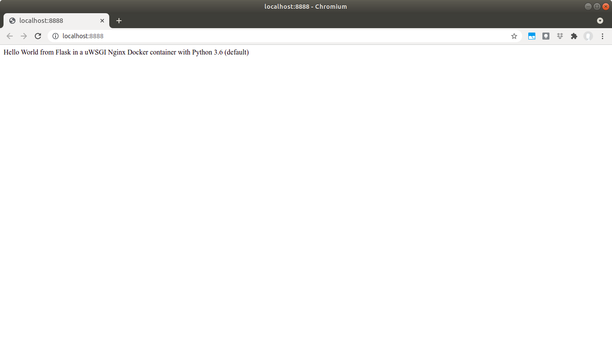
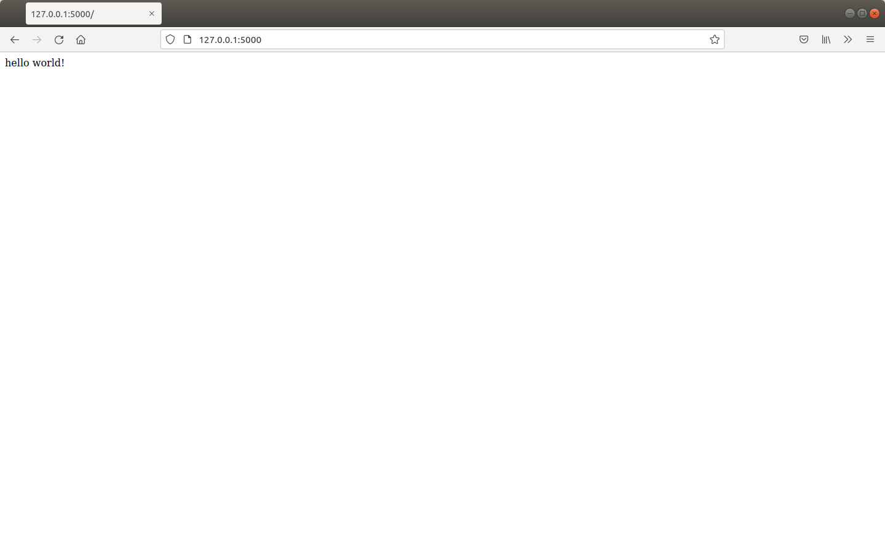

# Домашнее задание 2. Про-версия
## 1. Установить Docker, вы вести версию докера с помощью команды docker –v
```shell
$ docker -v
Docker version 20.10.7, build 20.10.7-0ubuntu1~18.04.1
```
## 2. Распакуйте  архив docker_flask и соберите Контейнер с помощью команды build
```shell
$ cd ex1/docker_flask
$ docker build .
<!-- SKIP OUTPUT -->
Successfully built 34391da16168
```

Проверяем, какие образы доступны Docker
```shell
$ docker images
REPOSITORY                   TAG                   IMAGE ID       CREATED         SIZE
<none>                       <none>                34391da16168   3 minutes ago   198MB
tiangolo/uwsgi-nginx-flask   python3.6-alpine3.7   cdec3b0d8f20   16 months ago   189MB
```

Если при сборке указать флаг `-t`, получим удобное имя образа(вместо id) 
## 3. Запустите контейнер на 8888 порту, перейдите в браузере по адресу http://localhost:8888/ и сделайте скриншот результата

```shell
$ docker run -p 8888:80 34391da16168
```



Видно, что это не то, что мы ожидали.

```shell
python3 -mvenv venv
source venv/bin/activate
pip install -r requirements.txt
flask run
```


Для исправления, потребуется доработать `Dockerfile`

## 4. Подключитесь к контейнеру с помощью команды exec и создайте там новый текстовый файл test.txt с произвольным содержанием
Посмотрим, какие контейнеры у нас запущены:
```shell
$ docker ps -a
CONTAINER ID   IMAGE          COMMAND                  CREATED          STATUS          PORTS                                            NAMES
9f57cb802723   34391da16168   "/entrypoint.sh /sta…"   17 minutes ago   Up 21 seconds   443/tcp, 0.0.0.0:8888->80/tcp, :::8888->80/tcp   optimistic_rosalind
```

Подключаемся к контейнеру и делаем новый файл
```shell
$ docker exec -it optimistic_rosalind /bin/bash
bash-4.4# echo "Innopolis Data Science" > hello.txt
bash-4.4# exit
```

## 5. С помощью команды docker commit создайте новый  Docker образ на основе работающего контейнера

```shell
$ docker container commit optimistic_rosalind
sha256:79a6721460039cd9a4137f8311077ed4f32159efcd5de20053f9d69233812c2e
```

Посмотрим, какие образы у нас в наличии
```shell
$ docker images
REPOSITORY                   TAG                   IMAGE ID       CREATED         SIZE
<none>                       <none>                79a672146003   6 seconds ago   199MB
tiangolo/uwsgi-nginx-flask   python3.6-alpine3.7   cdec3b0d8f20   16 months ago   189MB
```

Видим, что сборка без тага была плохой идеей. Сделаем коммит с тагом.
```shell
docker container commit optimistic_rosalind docker_flask:commit
sha256:a8ac551cfdf99bc167677a61bdcf9e0e75f15c74f715769163b3dab6ef79d80b
```

Еще раз посмотрим образы:
```shell
$ docker images
REPOSITORY                   TAG                   IMAGE ID       CREATED          SIZE
docker_flask                 commit                a8ac551cfdf9   4 seconds ago    199MB
<none>                       <none>                79a672146003   55 seconds ago   199MB
tiangolo/uwsgi-nginx-flask   python3.6-alpine3.7   cdec3b0d8f20   16 months ago    189MB
```
Видим, что появился образ docker_flask с тагом commit - в будущем может быть полезным

## 6. Запустите Контейнер из созданного образа , указав другой порт (8000), убедитесь в браузере что контейнер запущен, подключитесь к контейнеру еще раз с помощью команды exec и проверьте что созданный вами файл на месте

Запускаем контейнер из нового образа
```shell
$ docker run -d -p 8000:80 docker_flask:commit
`7c0db3d300e6117d4f069c113bd490f43176818ffbcd75ba32519d17c4dad6ef`
```

Убедимся, что образ запустился на порту 8000


Подключимся к запущенному контейнеру `7c0db3d300e6117d4f069c113bd490f43176818ffbcd75ba32519d17c4dad6ef`
```shell
$ docker exec -it 7c0db3d300e6117d4f069c113bd490f43176818ffbcd75ba32519d17c4dad6ef /bin/bash
bash-4.4# cat hello.txt 
Innopolis Data Science
```

Видим, что файл и его содержимое на месте.

## 7. Перепишите код функции ./app/views.py таким образом, чтобы функция могла принять POST или GET запрос  и принимая на вход текстовую переменную name и возвращала Hello <name> ( return ‘Hello {}’.format(name))

Данное упражнение потребует доработать Dockerfile, чтобы он запускал наше приложение, а также файл views.py, чтобы наш обработчик запроса мог принимать параметры.
